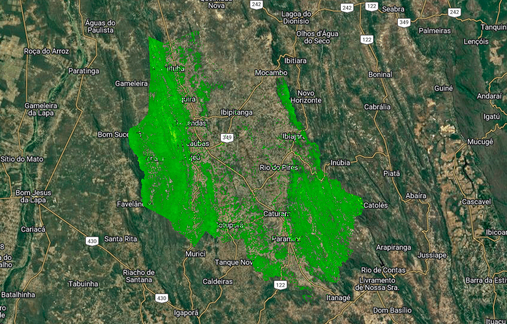

# GEE Geospatial Toolkit

Reusable Google Earth Engine workflows for hydrology, climate, remote sensing and geospatial analysis.

<p align="center">
  
</p>

<p align="center">


</p>

---

# Overview

**GEE Geospatial Toolkit** is an open-source collection of reusable **Google Earth Engine** workflows designed for environmental monitoring, hydrological analysis, climate applications and geospatial processing.

Instead of providing isolated scripts, the repository is organized into independent modules that can be reused individually or integrated into complete geospatial workflows.

The toolkit focuses on modularity, reproducibility and interoperability, allowing researchers, developers and GIS professionals to adapt each workflow to different study areas and environmental applications.

---

# Philosophy

The project follows five design principles.

- Reusable workflows
- Modular architecture
- Open datasets
- Reproducible analysis
- Easy integration between modules

Each module can be executed independently while maintaining compatibility with the rest of the toolkit.

---

# Main Modules

| Module | Description |
|----------|-------------|
| **Hydrology** | Hydrological indicators, water balance, runoff, evapotranspiration and drought assessment. |
| **Climate** | SPI, precipitation analysis, climate indicators and forecast integration. |
| **Satellite** | Satellite preprocessing and visualization workflows. |
| **Irrigation** | Irrigation suitability assessment and water-use monitoring. |
| **Vegetation** | Vegetation indices and ecosystem monitoring *(under development).* |
| **Utilities** | Shared helper functions *(under development).* |
| **Examples** | Example applications using the toolkit. |
| **Docs** | Documentation and references. |

---

# Repository Architecture

```text
gee-geospatial-toolkit/

README.md
LICENSE

assets/

hydrology/

climate/

satellite/

irrigation/

vegetation/

utilities/

examples/

docs/
```

---

# Module Overview

## Hydrology

Hydrological workflows based on precipitation, evapotranspiration and water balance.

Current capabilities

- CHIRPS precipitation
- Hydrological deficit
- Climatic deficit
- MODIS evapotranspiration
- SEBAL
- Crop Water Stress Index (CWSI)

---

## Climate

Climate analysis workflows using historical observations and climate forecasts.

Current capabilities

- Hybrid SPI
- Municipality statistics
- Climate dashboard
- CSV export

---

## Satellite

Satellite image preprocessing workflows.

Current capabilities

- Sentinel-2 RGB composites
- Cloud masking
- GeoTIFF export

Future modules

- Landsat
- MODIS
- Sentinel-1

---

## Irrigation

Environmental monitoring workflows focused on irrigation detection.

Current capabilities

- Multi-Criteria Irrigation Suitability Model
- NDVI
- NDMI
- NDWI
- Seasonal anomaly
- Percentile ranking (P95)
- Priority areas for field inspection

---

## Vegetation

Future vegetation monitoring workflows.

Planned

- NDVI

- EVI

- SAVI

- LAI

- GPP

---

## Utilities

Shared functions used across workflows.

Planned

- Export tools

- Statistics

- Visualization

- Color palettes

- Charts

---
# Repository Structure

```text
gee-geospatial-toolkit/

├── README.md
├── LICENSE
│
├── assets/
│   ├── banner.png
│   ├── workflow.png
│   ├── architecture.png
│   │
│   ├── hydrology/
│   ├── climate/
│   ├── irrigation/
│   ├── satellite/
│   ├── vegetation/
│   └── sebal/
│
├── hydrology/
│   ├── README.md
│   ├── precipitation_chirps.js
│   ├── hydrological_deficit.js
│   ├── climatic_deficit.js
│   ├── evapotranspiration_modis.js
│   ├── evapotranspiration_sebal.js
│   └── cwsi_modis.js
│
├── climate/
│   ├── README.md
│   ├── spi/
│   │   ├── README.md
│   │   └── spi_hybrid_temporal.js
│   ├── spei/
│   ├── era5/
│   └── chirps/
│
├── satellite/
│   ├── README.md
│   ├── sentinel2/
│   │   └── export_rgb_composite.js
│   ├── landsat/
│   └── modis/
│
├── irrigation/
│   ├── README.md
│   └── multi_criteria_irrigation_model.js
│
├── vegetation/
│
├── utilities/
│
├── examples/
│
└── docs/
```

---

# Workflow

The toolkit follows a modular processing architecture.

```text
Open Geospatial Data
          │
          ▼
Satellite Acquisition
          │
          ▼
Image Preprocessing
          │
          ▼
Environmental Indicators
          │
 ┌────────┼────────┬────────┬────────┐
 ▼        ▼        ▼        ▼
Hydrology Climate Satellite Irrigation
          │
          ▼
Maps
Statistics
Indicators
Dashboards
GeoTIFF
CSV
```

The modular design allows individual workflows to be executed independently or combined into complete environmental monitoring pipelines.

---

# Supported Datasets

| Dataset | Provider | Main Application |
|----------|----------|------------------|
| CHIRPS Daily | UCSB | Precipitation |
| NOAA CFSv2 | NOAA | Climate Forecast |
| GLDAS NOAH | NASA | Runoff |
| MOD16A2GF | MODIS | Evapotranspiration |
| MCD12Q1 | MODIS | Land Cover |
| Sentinel-2 MSI | ESA | Optical Imagery |
| Landsat Collection 2 | USGS | Surface Reflectance |
| HydroSHEDS | WWF | Watershed Delineation |
| SRTM | NASA | Digital Elevation Model |

---

# Applications

The toolkit can be applied to a wide range of environmental and geospatial studies.

## Hydrology

- Watershed monitoring
- Water balance
- Hydrological deficit
- Runoff estimation
- Drought monitoring

---

## Climate

- SPI
- Climate anomalies
- Seasonal monitoring
- Forecast integration
- Climate indicators

---

## Remote Sensing

- RGB composites
- Cloud masking
- Vegetation monitoring
- Water detection
- Land surface analysis

---

## Irrigation

- Irrigation suitability assessment
- Water abstraction screening
- Priority areas for field inspection
- Environmental compliance

---

## Environmental Monitoring

- Watershed management
- Protected areas
- Environmental inspection
- Decision support
- Geospatial intelligence

---

# Quick Start

Clone the repository

```bash
git clone https://github.com/xdanvieira/gee-geospatial-toolkit.git
```

Open the desired workflow inside the **Google Earth Engine Code Editor**.

Example:

```text
hydrology/
└── hydrological_deficit.js
```

or

```text
climate/
└── spi/
    └── spi_hybrid_temporal.js
```

Adapt the study area, execute the script and export the generated products.

---

# Outputs

Depending on the selected workflow, the toolkit can generate:

- GeoTIFF rasters
- CSV tables
- Interactive dashboards
- Time series
- Environmental indicators
- Spatial statistics
- Priority ranking
- Municipality summaries
- Charts
- Maps

---

# Documentation

Each module includes its own documentation.

| Module | Documentation |
|----------|---------------|
| Hydrology | `hydrology/README.md` |
| Climate | `climate/README.md` |
| Satellite | `satellite/README.md` |
| Irrigation | `irrigation/README.md` |

Additional technical documentation will be available in the **docs/** directory.
----

---

# Featured Workflows

The toolkit currently provides reusable workflows for hydrology, climate monitoring, remote sensing and irrigation assessment.

## Hydrology

| Workflow | Description | Status |
|----------|-------------|:------:|
| CHIRPS Precipitation | Monthly and annual precipitation analysis | ✅ |
| Hydrological Deficit | Water balance (P − ET) | ✅ |
| Climatic Deficit | Climatic water deficit (ETp − P) | ✅ |
| MODIS Evapotranspiration | ET and PET estimation | ✅ |
| SEBAL | Surface Energy Balance Algorithm for Land | ✅ |
| Crop Water Stress Index (CWSI) | Water stress assessment | ✅ |
| GLDAS Runoff | Surface runoff estimation | 🚧 |

---

## Climate

| Workflow | Description | Status |
|----------|-------------|:------:|
| Hybrid SPI | CHIRPS + NOAA CFSv2 | ✅ |
| Municipality Ranking | Drought ranking by municipality | ✅ |
| Interactive Dashboard | Dynamic SPI visualization | ✅ |
| CSV Export | Municipality statistics | ✅ |
| SPEI | Standardized Precipitation Evapotranspiration Index | 🚧 |
| ERA5-Land | Climate variables | 🚧 |

---

## Satellite

| Workflow | Description | Status |
|----------|-------------|:------:|
| Sentinel-2 RGB Composite | Cloud-free RGB mosaics | ✅ |
| Cloud Mask | SCL masking | ✅ |
| GeoTIFF Export | Export processed imagery | ✅ |
| NDVI | Vegetation Index | 🚧 |
| NDWI | Water Index | 🚧 |
| Landsat Support | Surface Reflectance | 🚧 |

---

## Irrigation

| Workflow | Description | Status |
|----------|-------------|:------:|
| Multi-Criteria Irrigation Model | Potential irrigated area detection | ✅ |
| Seasonal Anomaly | Dry vs. wet season comparison | ✅ |
| P95 High Confidence Areas | Priority irrigation areas | ✅ |
| Top-30 Priority Ranking | Field inspection support | ✅ |
| Irrigated Area Classification | Machine learning classification | 🚧 |

---

# Example Results

## Hydrological Deficit

<p align="center">

</p>

Hydrological deficit calculated from precipitation and evapotranspiration.

---

## Climatic Deficit

<p align="center">

</p>

Long-term climatic deficit based on potential evapotranspiration.

---

## Hybrid SPI

<p align="center">

</p>

Interactive drought monitoring using CHIRPS observations and CFSv2 forecast.

---

## Irrigation Suitability

<p align="center">

</p>

Multi-criteria irrigation suitability score.

---

## High-Confidence Areas

<p align="center">

</p>

Areas above the 95th percentile used for field prioritization.

---

## Top-30 Priority Locations

<p align="center">

</p>

Highest-ranked irrigation candidates.

---

## SEBAL

<p align="center">

| Net Radiation | Soil Heat Flux |
|---------------|----------------|
|  |  |

| Latent Heat Flux | Evaporative Fraction |
|------------------|----------------------|
|  |  |

| Daily Evapotranspiration | Gross Primary Productivity |
|--------------------------|----------------------------|
|  |  |

</p>

Example outputs generated using the Surface Energy Balance Algorithm for Land (SEBAL).

---

# Why GEE Geospatial Toolkit?

Unlike isolated Google Earth Engine scripts, this repository provides a structured collection of reusable workflows that can be combined into complete environmental monitoring pipelines.

### Advantages

- Modular architecture
- Open-source workflows
- Reusable code
- Standardized folder organization
- Integrated documentation
- Ready for scientific and operational applications
- Easy adaptation to new study areas
- Built on open geospatial datasets

---

# Current Statistics

| Metric | Value |
|---------|------:|
| Modules | 7 |
| Workflows | 15+ |
| Supported datasets | 9 |
| Satellite missions | 4 |
| Programming language | JavaScript |
| Platform | Google Earth Engine |

---
# Roadmap

The toolkit is continuously evolving to include new workflows, datasets and geospatial applications.

---

## Hydrology

- [x] CHIRPS precipitation
- [x] Hydrological deficit (P − ET)
- [x] Climatic deficit (ETp − P)
- [x] MODIS evapotranspiration
- [x] SEBAL evapotranspiration
- [x] Crop Water Stress Index (CWSI)
- [ ] GLDAS runoff workflow
- [ ] Soil moisture (SMAP)
- [ ] Water balance module

---

## Climate

- [x] Hybrid SPI (CHIRPS + CFSv2)
- [ ] Standard SPI
- [ ] SPEI
- [ ] ERA5-Land integration
- [ ] Climate anomaly maps
- [ ] Seasonal drought monitoring

---

## Remote Sensing

- [x] Sentinel-2 RGB composite
- [x] Cloud masking
- [ ] NDVI
- [ ] NDWI
- [ ] EVI
- [ ] SAVI
- [ ] Landsat preprocessing
- [ ] MODIS utilities

---

## Irrigation

- [x] Multi-Criteria Irrigation Suitability Model
- [x] Priority ranking (P95)
- [ ] Irrigated area classification
- [ ] Water abstraction risk model
- [ ] Time-series irrigation monitoring

---

## Machine Learning

- [ ] Random Forest
- [ ] XGBoost
- [ ] CatBoost
- [ ] Land cover classification
- [ ] Environmental susceptibility models

---

## Web Applications

- [ ] Streamlit applications
- [ ] WebGIS
- [ ] Interactive dashboards
- [ ] REST API
- [ ] Earth Engine Apps

---

# Contributing

Contributions are welcome.

If you would like to improve the toolkit:

1. Fork the repository.
2. Create a new branch.
3. Commit your changes.
4. Submit a Pull Request.

Bug reports, feature requests and suggestions are also appreciated.

---

# Documentation

Each module contains its own documentation.

| Module | Documentation |
|----------|---------------|
| Hydrology | `hydrology/README.md` |
| Climate | `climate/README.md` |
| Satellite | `satellite/README.md` |
| Irrigation | `irrigation/README.md` |

Additional technical documentation is available in the **docs/** directory.

---

# Citation

If this toolkit contributes to your research or professional work, please cite it.

```bibtex
@software{vieira2026,
  author  = {Danilo Vieira},
  title   = {GEE Geospatial Toolkit},
  year    = {2026},
  url     = {https://github.com/xdanvieira/gee-geospatial-toolkit}
}
```

---

# License

This project is distributed under the **MIT License**.

See the **LICENSE** file for additional information.

---

# Author

## Danilo Vieira

Environmental Engineer

Specialist in Geotechnologies

Data Scientist (in training)

Google Earth Engine Developer

Product Owner

Geospatial Intelligence

---

# Related Projects

| Repository | Description |
|------------|-------------|
| **hydrological-monitoring-gee** | Applied workflows for hydrological and climate monitoring using Google Earth Engine. |
| **gee-geospatial-toolkit** | Reusable workflows for hydrology, climate, remote sensing and geospatial analysis. |

---

# Acknowledgements

This toolkit is built upon open geospatial datasets and platforms provided by:

- Google Earth Engine
- NASA
- NOAA
- ESA
- USGS
- UCSB Climate Hazards Center
- WWF HydroSHEDS
- FAO

Their commitment to open data has made environmental monitoring more accessible to researchers and practitioners worldwide.

---

# Support

If you find this project useful:

⭐ Star this repository

🍴 Fork the repository

📢 Share it with the geospatial community

🤝 Contribute with new workflows

---

<p align="center">

**GEE Geospatial Toolkit**

Reusable Google Earth Engine workflows for environmental monitoring.

</p>
