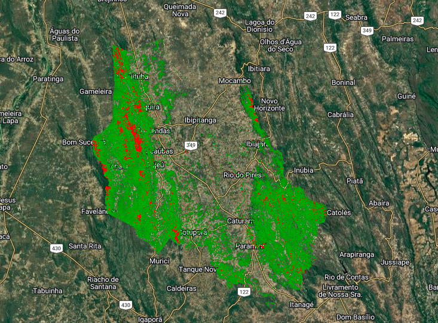
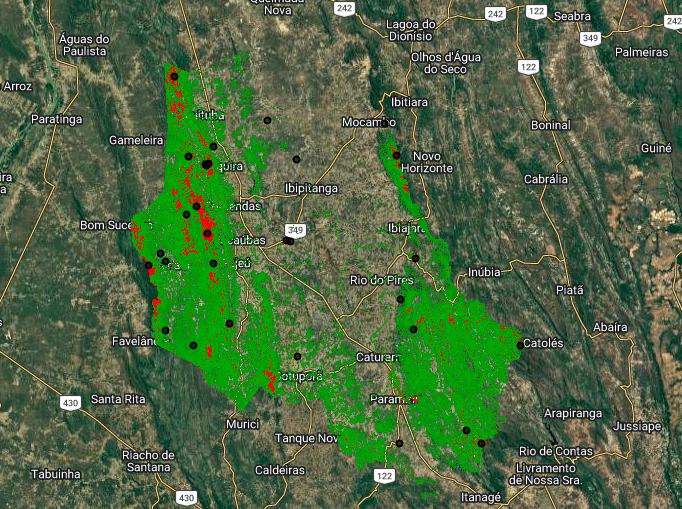

# Irrigation

Google Earth Engine workflows for identifying potential irrigated areas, water use patterns and high-confidence irrigation signals using satellite imagery.

---

## Available Workflows

| Script | Description |
|---|---|
| `possible_irrigation_score.js` | Conservative Sentinel-2 based score for identifying potential irrigated areas using NDVI, NDMI, NDWI and seasonal vegetation anomaly. |

---

## Method

The workflow compares wet and dry season Sentinel-2 composites and calculates a conservative score using:

- Dry season NDVI
- Dry season NDMI
- Dry season NDWI
- Seasonal NDVI anomaly
- Minimum valid observation count
- P95 threshold for high-confidence areas

## Example Results

### Irrigation Suitability Score

Continuous score representing potential irrigated areas.

---

### High Confidence Areas (P95)

Pixels above the 95th percentile representing the most reliable irrigation candidates.

---

### Top 30 Priority Locations

Highest-ranked locations selected for field verification and environmental inspection.

---

## Outputs

- Irrigation possibility score
- High-confidence mask using P95
- Top 30 ranked points
- GeoTIFF exports
- Shapefile export

---

## Applications

- Irrigation monitoring
- Water use screening
- Watershed management
- Environmental inspection
- Remote sensing based field prioritization

---

## License

MIT License.
